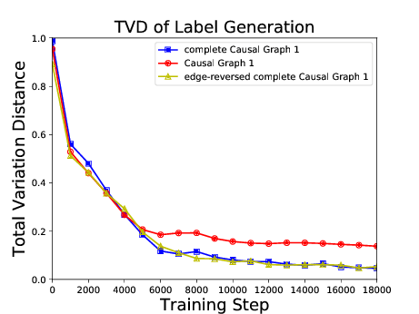

# CausalGAN/CausalBEGAN in Tensorflow

Tensorflow implementation of [CausalGAN: Learning Causal Implicit Generative Models with Adversarial Training, arXiv link to the paper]

### Top: Random samples from do(Bald=1); Bottom: Samples from cond(Bald=1)

### Top: Random samples from do(Mustache=1); Bottom: Samples from cond(Mustache=1)

## Requirements
- Python 2.7
- [Pillow](https://pillow.readthedocs.io/en/4.0.x/)
- [tqdm](https://github.com/tqdm/tqdm)
- [requests](https://github.com/kennethreitz/requests) (Only used for downloading CelebA dataset)
- [TensorFlow 1.1.0](https://github.com/tensorflow/tensorflow)

## Getting Started

First download [CelebA](http://mmlab.ie.cuhk.edu.hk/projects/CelebA.html) datasets with:

    $ apt-get install p7zip-full # ubuntu
    $ brew install p7zip # Mac
    $ pip install tqdm
    $ python download.py

## Usage

The CausalGAN/CausalBEGAN code factorizes into two components, which can be trained or loaded independently: the causal_controller module specifies the model which learns a causal generative model over labels, and the causal_dcgan or causal_began modules learn a GAN over images given those labels. We denote training the causal controller over labels as "pretraining" (--is_pretrain=True), and training a GAN over images given labels as "training" (--is_train=True)

To train a causal implicit model over labels and then over the image given the labels use

    $ python main.py --causal_model big_causal_graph --is_pretrain True --model_type began --is_train True

where "big_causal_graph" is one of the causal graphs specified by the keys in the causal_graphs dictionary in causal_graph.py. 

Alternatively, one can first train a causal implicit model over labels only with the following command:

    $ python main.py --causal_model big_causal_graph --is_pretrain True

One can then train a conditional generative model for the images given the trained causal generative model for the labels (causal controller), which yields a causal implicit generative model for the image and the labels, as suggested in [arXiv link to the paper]:

    $ echo CC-MODEL_PATH='./logs/celebA_0810_191625_0.145tvd_bcg/controller/checkpoints/CC-Model-20000'
    $ python main.py --causal_model big_causal_graph --pt_load_path $CC-MODEL_PATH --model_type began --is_train True 

Instead of loading the model piecewise, once image training has been run once, the entire joint model can be loaded more simply by specifying the model directory:

    $ python main.py --causal_model big_causal_graph --load_path ./logs/celebA_0815_170635 --model_type began --is_train True 

Tensorboard visualization of the most recently created model is simply (as long as port 6006 is free):

    $ python tboard.py

To interact with an already trained model I recommend the following procedure:

    ipython
    In [1]: %run main --causal_model big_causal_graph --load_path './logs/celebA_0815_170635' --model_type 'began'

For example to sample N=22 interventional images from do(Smiling=1) (as long as your causal graph includes a "Smiling" node:

    In [2]: sess.run(model.G,{cc.Smiling.label:np.ones((22,1), trainer.batch_size:22})

Conditional sampling is most efficiently done through 2 session calls: the first to cc.sample_label to get, and the second feeds that sampled label to get an image. See trainer.causal_sampling for a more extensive example. Note that is also possible combine conditioning and intervention during sampling.

    In [3]: lab_samples=cc.sample_label(sess,do_dict={'Bald':1}, cond_dict={'Mustache':1},N=22)

will sample all labels from the joint distribution conditioned on Mustache=1 and do(Bald=1). These label samples can be turned into image samples as follows:

    In [4]: feed_dict={cc.label_dict[k]:v for k,v in lab_samples.iteritems()}
    In [5]: feed_dict[trainer.batch_size]=22
    In [6]: images=sess.run(trainer.G,feed_dict)

### Configuration
Since this really controls training of 3 different models (CausalController, CausalGAN, and CausalBEGAN), many configuration options are available. To make things managable, there are 4 files corresponding to configurations specific to different parts of the model. Not all configuration combinations are tested. Default parameters are gauranteed to work.

configurations:
./config.py  :  generic data and scheduling
./causal_controller/config  :  specific to CausalController
./causal_dcgan/config  :  specific to CausalGAN
./causal_began/config  :  specific to CausalBEGAN

For convenience, the configurations used are saved in 4 .json files in the model directory for future reference.

## Results

### Causal Controller convergence
We show convergence in TVD for Causal Graph 1 (big_causal_graph in causal_graph.py), a completed version of Causal Graph 1 (complete_big_causal_graph in causal_graph.py, and an edge reversed version of the complete Causal Graph 1 (reverse_big_causal_graph in causal_graph.py). We could get reasonable marginals with a complete DAG containing all 40 nodes, but TVD becomes very difficult to measure. We show TVD convergence for 9 nodes for two complete graphs. When the graph is incomplete, there is a "TVD gap" but reasonable convergence.

### Conditional vs Interventional Sampling:
We trained a causal implicit generative model assuming we are given the following causal graph over labels:
For the following images when we condition or intervene, these operations can be reasoned about from the graph structure. e.g., conditioning on mustache=1 should give more male whereas intervening should not (since the edges from the parents are disconnected in an intervention).

### CausalGAN Conditioning vs Intervening
For each label, images were randomly sampled by either _intervening_ (top row) or _conditioning_ (bottom row) on label=1.

### CausalBEGAN Conditioning vs Intervening
For each label, images were randomly sampled by either _intervening_ (top row) or _conditioning_ (bottom row) on label=1.

### CausalGAN Generator output (10x10) (randomly sampled label)

### CausalBEGAN Generator output (10x10) (randomly sampled label)

## Related works
<---
  Repo originally forked from these two
- [BEGAN-tensorflow](https://github.com/carpedm20/BEGAN-tensorflow)
- [DCGAN-tensorflow](https://github.com/carpedm20/DCGAN-tensorflow)
- [BEGAN: Boundary Equilibrium Generative Adversarial Networks](https://arxiv.org/abs/1703.10717)
-->

## Authors

Christopher Snyder / [@22csnyder](http://22csnyder.github.io)
Murat Kocaoglu / [@mkocaoglu](http://mkocaoglu.github.io)
